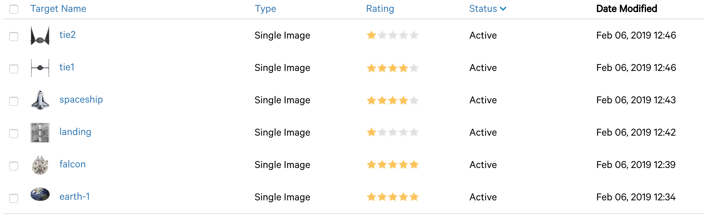
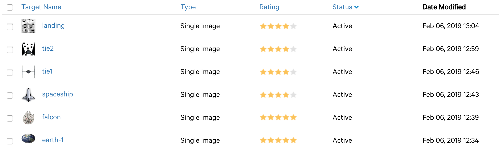

# Assignment 1

a) Generate individual image targets from each of the images of the template. Use exact measurements and be consistent with your units.

**Initial targets**

b) You will realize that some of the image targets have a very bad Augmentable rating in the Vuforia target manager. Add visual features to your image targets or completely rework them. You can follow this guide. Keep it close to what the targets depict, e.g., the spaceship should still be recognizable as such when looking at it. Every target has to have a rating of at least 3 stars in the end.

**Improved targets**

Why was it initially hard to track for Vuforia and why did your features improve it? Why was it not necessary for some of the targets?

*We strected the contrast an added rectangular objects.* 

***Vuforia** (as well as all other Computer Vision libraries) are more capable of detecting edges and corners.*

**extra 0.5pt** Achieve an Augmentable rating of at least 4 stars per target while keeping them close to what they depict.

*Check!!* [x]